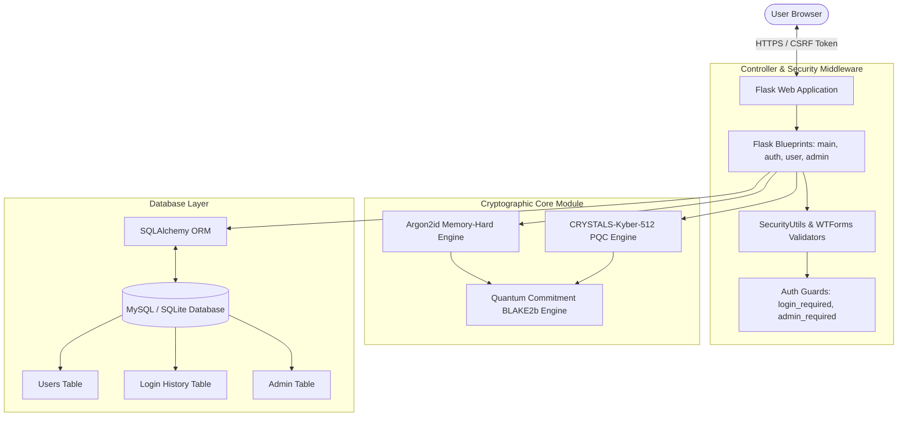
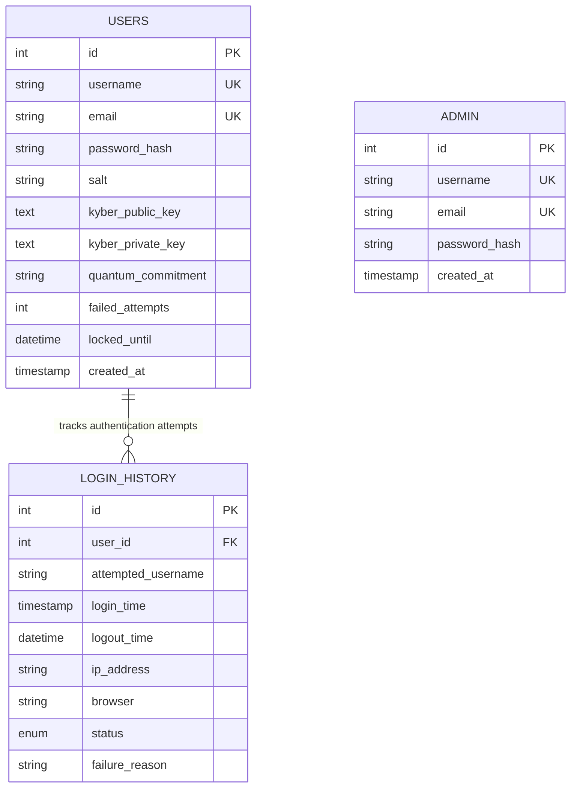
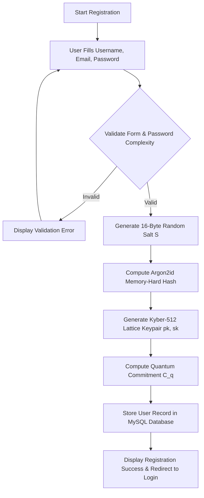
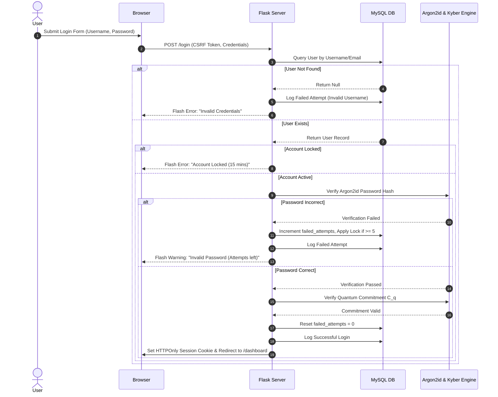

# QuantumShield - System Architecture & Diagrams

This document presents the visual structural diagrams for the QuantumShield Post-Quantum Authentication Framework.

---

## 1. System Architecture Diagram

---

## 2. Database ER Diagram

---

## 3. Registration Flowchart

---

## 4. Authentication Sequence Diagram

